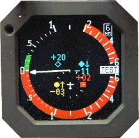
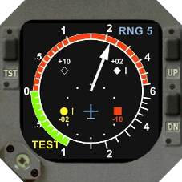

# Integrating X-TCAS into your aircraft

Unlike many addons for X-Plane, X-TCAS is designed to be integrated into
and shipped with aircraft models, rather than be installed by end-users
directly into their plugins folder. This guide discusses how to perform
this integration.

## Principle of operation

X-TCAS is a fully self-contained TCAS computer simulation, with a
pluggable interface system to allow integrating it into various simulator
environments. X-TCAS has three components:

1. **The acquisition module.** This component receives air data inputs,
as well as the positions of the surrounding aircraft traffic from the
simulator. This module essentially simulates the radio components,
digital signal processing and data filtering functions of real TCAS
units. The information from this module is then passed on to the core
TCAS computer for processing in its traffic analysis and resolution
generator engine.
1. **The TCAS computer module.** This component receives data from the
acquisition module and constructs a 3-dimensional image of the airspace
surrounding the aircraft. It is also responsible for generating traffic
alerts and resolution advisories.
1. **The avionics output module.** This component receives processed
contact information, traffic alerts and resolution advisories from the
TCAS computer module and forwards it to the simulated aircraft avionics
for display.

While the core TCAS computer module never changes, both the acquisition
and output modules can be configured during build time to produce various
X-TCAS versions that talk to different simulators and simulated aircraft
avionics. At the moment, X-TCAS supports the following interface modules:

1. **An acquisition module for X-Plane 10/11.** This module acquires air
data and contact information from the X-Plane 10 or X-Plane 11
environment via the built-in air data and multiplayer aircraft position
datarefs. These datarefs provide out-of-the-box compatibility with the
built-in X-Plane AI aircraft system, as well as various 3rd party online
flight simulation networks such as PilotEdge, VATSIM and IVAO.
1. **An avionics output module for the FlightFactor 320 Ultimate.** This
module provides the interface to the FlightFactor 320 Ultimate product.
1. **A generic VSI-style drawing and output module.** This module allows
for a quick-and-easy implementation of a TCAS II retrofit into aircraft
models simulating legacy avionics with no built-in TCAS display
capabilities. See the "VSI Output Module" section below for details on
how to integrate this module.

## Configuring X-TCAS

TCAS the follow two main settings which are controlled by the pilot:

1. **Mode of operation:** this is a mandatory setting, which determines
the TCAS mode setting inside the transponder and must be one of:
   * **STBY**: TCAS is inactive and displays no traffic information or
   issues advisories.
   * **TA-ONLY:** TCAS performs active surveillance, displays traffic and
   issues traffic advisories according to standard TCAS operational
   parameters, but no resolution advisories will be generated.
   * **TA/RA:** TCAS performs active surveillance, displays traffic and
   issues both traffic advisories and resolution advisories according to
   standard TCAS operational parameters.
2. **Display filter:** this is an optional setting and not every TCAS
implementation provides it. It controls the vertical display extent of
TCAS traffic. The filter setting is one of:
   * **ALL:** (default) TCAS traffic is displayed if within 40NM of the
   aircraft horizontally and at a relative altitude of between -2700 ft
   to +2700 ft.
   * **ABV:** same as **ALL**, except the relative altitude range is
   from -2700 ft to +9900 ft.
   * **ALL:** same as **ALL**, except the relative altitude range is
   from -9900 ft to +2700 ft.
   * **THRT:** (threat mode) TCAS traffic is not displayed. If a traffic
   advisory or resolution advisory occurs, TCAS traffic is displayed
   temporarily according to the same rules as the **ALL** filter. Once
   the traffic advisory or resolution advisory has been cleared, TCAS
   traffic is again removed from view.

To integrate X-TCAS you must create cockpit controls and bind them to the
following datarefs:

* `xtcas/mode_req`: controls the requested TCAS mode. Valid values are: 0
= STBY, 1 = TA-ONLY and 2 = TA/RA. You can read the actual mode of operation
via the `xtcas/mode_act` dataref. A discrepancy between `mode_req` and
`mode_act` can occur if TCAS not receiving power or some part of TCAS has
failed (this manifests as X-TCAS forcibly setting the mode to STBY).
* `xtcas/filter_req`: controls the TCAS display filter. Valid values are:
0 = ALL, 1 = THRT, 2 = ABV and 3 = BLW. You can read the actual display
filter setting via the `xtcas/filter_act` dataref. These two datarefs are
always in sync.

### Transponder Integration

As TCAS requires an operational Mode S transponder to function, X-TCAS
also monitors the transponder mode setting via the
`sim/cockpit/radios/transponder_mode` dataref:

* `transponder_mode=0`: X-TCAS is powered off.
* `transponder_mode=1`: X-TCAS is powered on, but the TCAS mode is locked
to STBY.
* For any other value TCAS is active in the mode selected in the
`mode_req` dataref (subject to there being sufficient electrical voltage
and no system failure).

### Powering the TCAS Computer

By default, the TCAS computer core automatically powers on as soon as
power is applied to the first aircraft DC bus, the bus voltage is at
least 22 Volts and the transponder is not OFF. Although X-TCAS simulates
only one TCAS core, you can emulate a redundant TCAS installation by
dynamically changing X-TCAS's electrical parameters:

* `xtcas/busnr`: the number of the electrical bus that X-TCAS monitors to
determine bus voltage (this an index into
`sim/cockpit2/electrical/bus_volts`). This setting can also be statically
defined in the `X-TCAS.cfg` file using the `busnr` variable.
* `xtcas/min_volts`: minimum voltage required for X-TCAS to operate. To
disable the electrical bus check entirely, simply set this value to zero.
This setting can also be statically defined in the `X-TCAS.cfg` file by
setting the `min_volts` variable.

### Responding to Failures

X-TCAS can be configured to react to system failures. By default X-TCAS
monitors the following datarefs and a failure in any of them will result
in TCAS transitioning into a "failed" state:

* `sim/operation/failures/rel_xpndr`: Mode S transponder failure.
* `sim/operation/failures/rel_g_alt`: Barometric altimeter input failure.
* `sim/operation/failures/rel_adc_comp`: Air data computer failure.

You can take manual control of the TCAS computer system failures by
setting a custom failure enum dataref that should be monitored, by
writing a string into the `xtcas/fail_dr` dataref. This can also be set
in the `X-TCAS.cfg` file by setting the `fail_dr` variable. When a custom
failure dataref is defined, X-TCAS ignores the default X-Plane datarefs
for failures. Please note that the dataref referenced via `fail_dr` must
follow the X-Plane failure enum format (i.e. the value '6' meaning
'failed' and any other value meaning 'functional).

### Control Commands

In addition to datarefs, you can also use the following X-Plane commands
to control the TCAS computer core:

* `X-TCAS/test`: performs the TCAS functional test. This displays 4
contacts on the TCAS data display with all possible combinations of
status symbology and displays a resolution advisory on the PFD or VSI
(depending on installation). After 8 seconds, a synthetic voice
annunciates "TCAS SYSTEM TEST OK". If the TCAS unit has failed, or any of
its inputs have failed, the synthetic voice instead annunciates "TCAS
SYSTEM TEST FAIL". The test can only be initiated in the TCAS STBY mode.
You should create an appropriate cockpit control (e.g. a button, or a
transponder mode knob position) to perform the test.

* `X-TCAS/mode_stby`: sets the TCAS mode to **STBY**.

* `X-TCAS/mode_taonly`: sets the TCAS mode to **TA-ONLY**.

* `X-TCAS/mode_tara`: sets the TCAS mode to **TA/RA**.

* `X-TCAS/filter_all`: sets the vertical filter mode to **ALL**.

* `X-TCAS/filter_thrt`: sets the vertical filter mode to **THRT**.

* `X-TCAS/filter_abv`: sets the vertical filter mode to **ABV**.

* `X-TCAS/filter_blw`: sets the vertical filter mode to **BLW**.

## VSI Output Module

This module provides an easy method of implementing TCAS II as a retrofit
to aircraft simulating legacy avionics. It simulates a digital LCD
vertical speed indicator with embedded TCAS data display. The module can
be configured at build time to render itself as either the style found in
the ATR-42/72 aircraft, or as the Honeywell IVA 81A/C/D vertical speed
indicators. See below for examples of both displays.

In either case, X-TCAS provides the actual texture rendering of the VSI
display, including the VSI needle, vertical speed data acquisition and
TCAS data display. The module supports rendering up to 4 independent
VSIs, each with arbitrary vector scaling and positioning on the X-Plane
panel texture.

### Configuration

By default, X-TCAS doesn't place the VSI anywhere. To enable renderering
you need to configure the VSI displays either dynamically via the
appropriate datarefs, or statically by using `X-TCAS.cfg` variables (the
string '%d' in the names below is a number from 0 to 3 to define which
instances of the VSI you wish to configure):

* `xtcas/vsis/%d/x`: defines the X offset in the X-Plane panel texture
where this VSI should be drawn (0 being the left edge and increasing to
the right). Config file variable: `vsis/%d/x`.
* `xtcas/vsis/%d/y`: defines the Y offset in the X-Plane panel texture
where this VSI should be drawn (0 being the bottom edge and increasing
upward). Config file variable: `vsis/%d/y`.
* `xtcas/vsis/%d/sz`: the pixel size of the VSI render in the X-Plane
panel texture. This must be a positive number for X-TCAS to start
rendering this VSI. Setting this value to zero disables this instance of
the VSI. Config file variable: `vsis/%d/sz`.
* `xtcas/vsis/%d/scale`: an enum value from 0 to 4 defining the range
scale being shown on the VSI. For ATR-style VSIs, these enum values
correspond to the following ranges (in NM): 3, 6, 12, 24, 48. For
Honeywell-style VSIs, these enum values correspond to the following
ranges: 3, 5, 10, 20, 40. The config file variable `vsis/%d/scale`
defines the default scale that the VSI displays after bootup (by default
scale '1', i.e. 6NM on the ATR-style VSI and 5NM on the Honeywell-style
VSI).
* `xtcas/vsis/%d/brt`: controls the brightness of the display. When you
create a display dimming cockpit control for the VSI, bind it to this
dataref. The value must be an integer from 0 to 100 (the default is 50).
As with `vsis/%d/scale`, you can override the default brightness by
setting the `vsis/%d/brt` variable in the X-TCAS configuration file.
* `xtcas/vsis/%d/vs_src`: sets the vertical speed source dataref that
X-TCAS uses to determine the vertical speed that the VSI should indicate.
The defaults are:
   * `xtcas/vsis/0/vs_src`: `sim/cockpit2/gauges/indicators/vvi_fpm_pilot`
   * `xtcas/vsis/1/vs_src`: `sim/cockpit2/gauges/indicators/vvi_fpm_copilot`
   * `xtcas/vsis/2/vs_src`: `sim/cockpit2/gauges/indicators/vvi_fpm_pilot`
   * `xtcas/vsis/3/vs_src`: `sim/cockpit2/gauges/indicators/vvi_fpm_copilot`
* `xtcas/vsis/%d/vs_src_fmt`: controls the data format interpretation of
the value of the dataref referenced from `vs_src`. The config file variable
is `vsis/%d/vs_src_fmt`. The possible values are:
   * `vs_src_fmt=0`: (the default) feet-per-minute
   * `vs_src_fmt=1`: meters-per-second
   * `vs_src_fmt=2`: feet-per-second
   * `vs_src_fmt=3`: meters-per-minute
* `xtcas/vsis/%d/busnr`: defines which electrical bus powers this particular
VSI (this is an index into `sim/cockpit2/electrical/bus_volts`). The VSI
requires at least 22 Volts to operate. To disable the electrical check,
set this value to an invalid bus number (e.g. a negative number).
* `xtcas/vsis/%d/fail_dr`: defines which dataref is monitored by X-TCAS
to determine if a particular VSI has failed. The referenced dataref must be
in the X-Plane failure enum format. If the referenced dataref doesn't exist,
X-TCAS ignores failures for this particular VSI. The default values are:
   * `xtcas/vsis/0/fail_dr`: `sim/operation/failures/rel_ss_vvi`
   * `xtcas/vsis/1/fail_dr`: `sim/operation/failures/rel_cop_vvi`
   * `xtcas/vsis/2/fail_dr`: `sim/operation/failures/rel_ss_vvi`
   * `xtcas/vsis/3/fail_dr`: `sim/operation/failures/rel_cop_vvi`
